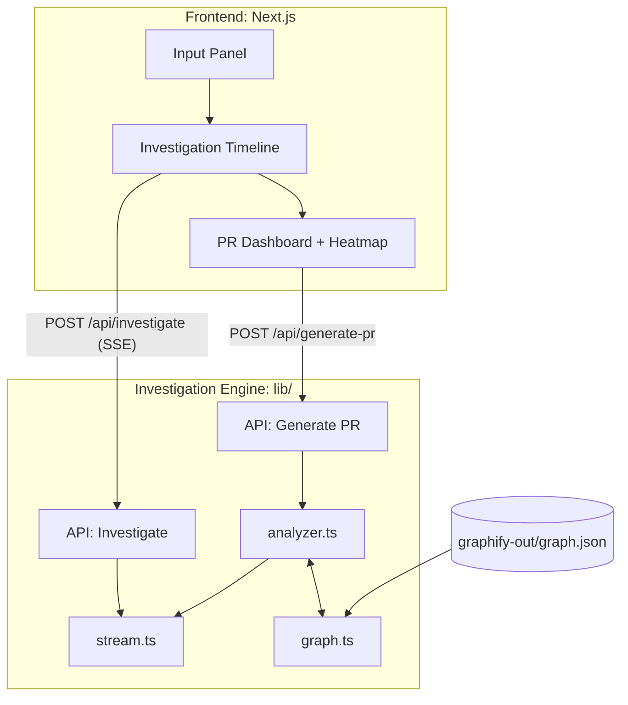

# PatchPilot

**Incident-to-PR AI Copilot — Powered by IBM Bob & Graphify**

> Turn production incidents into reviewer-ready pull requests in minutes, with full reasoning transparency.

---

## Problem

Every software team faces the same painful loop when a production incident hits:

1. Developer drops everything
2. Reads logs, searches the codebase
3. Hypothesizes the root cause
4. Writes a fix, tests, documentation
5. Opens a PR, waits for review

**Average time: 2–6 hours per incident.** For regulated industries, add audit trail requirements on top.

There is no tool today that combines AI-driven incident investigation with full reasoning transparency. **Until now.**

---

## Solution

PatchPilot is an **incident-to-PR copilot** that uses:

- **Graph-based reasoning** (via Graphify) to traverse dependency relationships
- **AI investigation engine** (IBM Bob) that thinks step-by-step
- **Full transparency** — every file explored, every hypothesis considered, every decision explained

### What makes it different?

| Feature | Traditional AI Tools | PatchPilot |
|---------|---------------------|------------|
| Output | Code suggestion | Complete PR package |
| Reasoning | Black box | Full audit timeline |
| Analysis | Keyword search | Graph traversal |
| Scope | Single file | Cross-module blast radius |
| Trust | "Trust me" | "Here's my evidence" |

---

## Architecture



---

## How Graphify Powers PatchPilot

Graphify generates a **code dependency graph** (`graph.json`) that PatchPilot uses for:

1. **Dependency Traversal** — When a stack trace mentions `auth.service.ts`, we don't just look at that file. We traverse the graph to find every module that imports it, calls it, or depends on it.

2. **Impact Scoring** — BFS propagation from root cause nodes, with confidence decay. Direct dependencies score ~70%, transitive ones ~25%.

3. **Blast Radius Calculation** — The heatmap visualization shows engineers exactly which parts of the codebase are affected by the bug and the proposed fix.

4. **Evidence-Based Reasoning** — Every step in the investigation timeline is backed by graph relationships, not keyword matching.

---

## Tech Stack

| Layer | Technology |
|-------|-----------|
| Framework | Next.js 14 (App Router) |
| Language | TypeScript |
| Styling | Tailwind CSS v3 |
| Animations | Framer Motion |
| Streaming | Server-Sent Events (SSE) |
| Graph Engine | Graphify + custom BFS |
| Icons | Lucide React |

---

## Quick Start

```bash
# Install dependencies
npm install

# Start development server
npm run dev

# Open in browser
open http://localhost:3000
```

### Demo Steps

1. Open `http://localhost:3000`
2. You'll see a pre-filled stack trace for an auth race condition bug
3. Click **"Investigate"**
4. Watch the **live reasoning timeline** — steps stream in real-time via SSE
5. Watch the **impact heatmap** light up as files are scanned
6. When complete, explore the **PR Dashboard**:
   - **Overview**: Root cause, risk analysis, rollback plan, blast radius
   - **Patch**: GitHub-style diff viewer with copy button
   - **Tests**: Generated regression tests
   - **Why This Fix?**: Graph-based reasoning explanation + impact heatmap

---

## Project Structure

```
PatchPilot/
├── app/
│   ├── api/
│   │   ├── investigate/route.ts    # SSE streaming endpoint
│   │   └── generate-pr/route.ts    # PR package endpoint
│   ├── globals.css                 # Design system
│   ├── layout.tsx                  # Root layout
│   └── page.tsx                    # Main orchestrator
├── components/
│   ├── Header.tsx                  # Top nav
│   ├── InputPanel.tsx              # Incident input
│   ├── InvestigationTimeline.tsx    # Live reasoning timeline
│   ├── Heatmap.tsx                 # Impact visualization
│   ├── PRDashboard.tsx             # PR output (tabs)
│   ├── DiffViewer.tsx              # Syntax-highlighted diff
│   └── ConfidenceBadge.tsx         # Score badge
├── lib/
│   ├── graph.ts                    # Graph intelligence engine
│   ├── analyzer.ts                 # Investigation + PR generator
│   └── stream.ts                   # SSE stream utilities
└── graphify-out/
    └── graph.json                  # Dependency graph
```

---

## Why It Scales

- **Any codebase**: Graphify can generate a graph for any repo. PatchPilot's engine is graph-agnostic.
- **Any incident format**: The analyzer extracts file paths from stack traces, error logs, or free-text bug reports.
- **Real AI integration**: The architecture is designed for IBM Bob — the mock engine follows the exact same interface. Swap the mock for a real API call and it works.
- **Audit-ready**: Every investigation step is timestamped and exportable. Compliance teams get a full reasoning record.

---

## License

MIT
