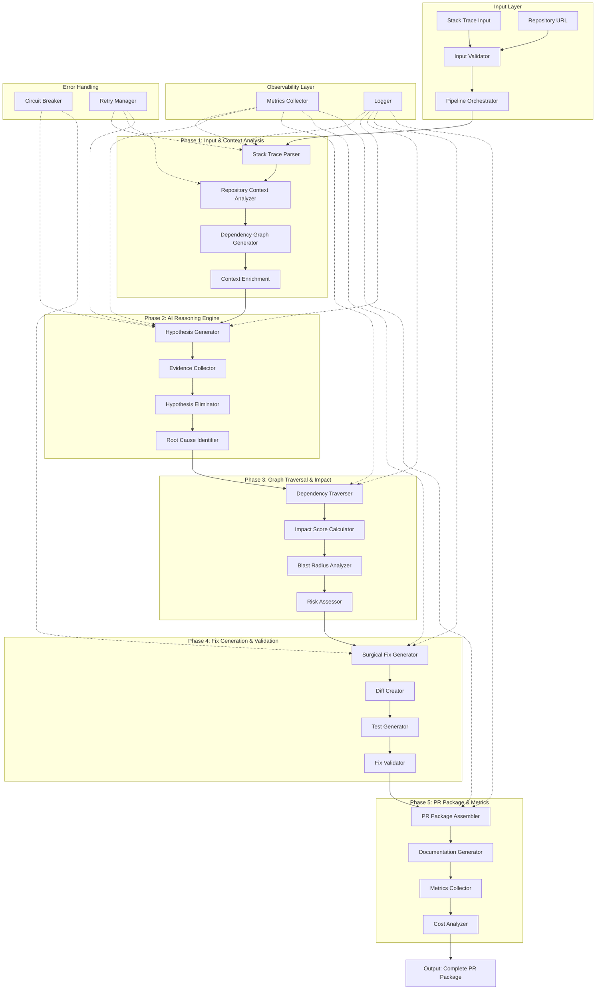

# 🏗️ Enterprise Pipeline Architecture for PatchPilot

**Version:** 2.0  
**Status:** Design Phase  
**Last Updated:** 2026-05-01

---

## 📋 Executive Summary

This document outlines the transformation of PatchPilot from a functional prototype into an enterprise-grade incident-to-PR pipeline system. The architecture emphasizes modularity, observability, scalability, and fault tolerance.

### Key Improvements

- **Modular Design**: 10 independent, testable phases
- **Pipeline Orchestration**: Centralized control with phase lifecycle management
- **Observability**: Comprehensive metrics, logging, and tracing
- **Error Handling**: Graceful degradation with retry logic and circuit breakers
- **Scalability**: Handles large codebases (10K+ files) efficiently
- **Cost Tracking**: Per-phase cost analysis and optimization

---

## 🎯 Current State Analysis

### Strengths ✅

1. **AI Integration**: IBM watsonx with graceful fallback
2. **Graph Analysis**: Dependency traversal and impact scoring
3. **GitHub Integration**: Repository cloning and file reading
4. **Real-time Streaming**: SSE for live updates
5. **Type Safety**: Full TypeScript implementation

### Gaps for Enterprise ❌

1. **No Pipeline Orchestration**: Phases are ad-hoc, not formally managed
2. **Limited Observability**: No structured metrics or tracing
3. **Tight Coupling**: Components depend directly on each other
4. **No Retry Logic**: Single-shot execution with no recovery
5. **Missing Validation**: No gates between phases
6. **No Cost Tracking**: Cannot optimize expensive operations
7. **Limited Error Recovery**: Fails completely on errors

---

## 🏛️ Enterprise Architecture Overview

### High-Level Pipeline Flow



---

## 📦 Phase Definitions

### Phase 1: Input & Context Analysis

**Purpose**: Parse incident data and gather repository context

**Components**:

1. **Stack Trace Parser**
   - Extract error messages, types, and classifications
   - Parse file paths and line numbers
   - Identify error patterns (TypeError, ReferenceError, etc.)
   - Extract function call chains

2. **Repository Context Analyzer**
   - Clone/access repository (with caching)
   - Scan file structure and patterns
   - Identify framework and architecture
   - Extract package dependencies

3. **Dependency Graph Generator**
   - Generate or load existing graph
   - Identify module relationships
   - Calculate centrality scores
   - Detect communities

4. **Context Enrichment**
   - Load relevant code snippets
   - Extract function signatures
   - Identify related test files
   - Gather historical incident data

**Inputs**:
```typescript
interface Phase1Input {
  stackTrace: string;
  repositoryUrl?: string;
  repositoryPath?: string;
  additionalContext?: Record<string, unknown>;
}
```

**Outputs**:
```typescript
interface Phase1Output {
  parsedError: {
    type: string;
    message: string;
    classification: ErrorClassification;
  };
  affectedFiles: Array<{
    path: string;
    lineNumber?: number;
    confidence: number;
  }>;
  repositoryContext: {
    framework: string;
    language: string;
    architecture: string;
    dependencies: string[];
  };
  dependencyGraph: {
    nodes: GraphNode[];
    edges: GraphEdge[];
    metrics: GraphMetrics;
  };
  codeSnippets: Array<{
    file: string;
    content: string;
    relevance: number;
  }>;
}
```

**Metrics**:
- Parse time (ms)
- Files scanned
- Graph generation time
- Cache hit rate

---

### Phase 2: AI Reasoning Engine

**Purpose**: Generate, evaluate, and confirm hypotheses using AI

**Components**:

1. **Hypothesis Generator**
   - Use IBM watsonx to generate 3-5 hypotheses
   - Score by likelihood (0.0-1.0)
   - Consider error patterns and graph structure
   - Include reasoning for each hypothesis

2. **Evidence Collector**
   - Gather supporting/contradicting evidence
   - Analyze code patterns
   - Check historical incidents
   - Validate against graph relationships

3. **Hypothesis Eliminator**
   - Systematically eliminate incorrect hypotheses
   - Provide concrete evidence for elimination
   - Update confidence scores
   - Document reasoning chain

4. **Root Cause Identifier**
   - Confirm final hypothesis
   - Generate detailed explanation
   - Identify exact location (file:line)
   - Calculate confidence score

**Inputs**:
```typescript
interface Phase2Input {
  context: Phase1Output;
  aiConfig: {
    model: string;
    temperature: number;
    maxTokens: number;
  };
}
```

**Outputs**:
```typescript
interface Phase2Output {
  hypotheses: Array<{
    id: string;
    text: string;
    confidence: number;
    reasoning: string;
    evidence: string[];
  }>;
  eliminations: Array<{
    hypothesisId: string;
    reason: string;
    evidence: string;
    timestamp: number;
  }>;
  rootCause: {
    description: string;
    confidence: number;
    location: {
      file: string;
      line: number;
      function?: string;
    };
    evidence: string[];
    reasoning: string;
  };
  aiMetrics: {
    tokensUsed: number;
    cost: number;
    latency: number;
    modelVersion: string;
  };
}
```

**Metrics**:
- Hypothesis generation time
- AI tokens consumed
- Cost per hypothesis
- Confidence score distribution

---

### Phase 3: Graph Traversal & Impact Analysis

**Purpose**: Calculate blast radius and assess impact

**Components**:

1. **Dependency Traverser**
   - BFS/DFS from affected nodes
   - Follow import/export chains
   - Identify transitive dependencies
   - Track traversal path

2. **Impact Score Calculator**
   - Propagation algorithm with decay
   - Direct dependencies: 1.0
   - First-hop: 0.7
   - Second-hop: 0.4
   - Third-hop: 0.2

3. **Blast Radius Analyzer**
   - Identify all affected files
   - Calculate impact scores
   - Rank by criticality
   - Detect critical paths

4. **Risk Assessor**
   - Analyze affected critical paths
   - Identify high-risk dependencies
   - Calculate overall risk score
   - Generate risk matrix

**Inputs**:
```typescript
interface Phase3Input {
  rootCause: Phase2Output['rootCause'];
  graph: Phase1Output['dependencyGraph'];
  traversalConfig: {
    maxDepth: number;
    decayFactor: number;
    minScore: number;
  };
}
```

**Outputs**:
```typescript
interface Phase3Output {
  affectedFiles: Array<{
    file: string;
    score: number;
    reason: string;
    distance: number;
    criticalPath: boolean;
  }>;
  blastRadius: {
    totalFiles: number;
    criticalFiles: number;
    communities: number;
    maxDepth: number;
  };
  traversalPath: string[];
  riskAssessment: {
    level: 'low' | 'medium' | 'high' | 'critical';
    score: number;
    factors: string[];
    mitigations: string[];
  };
  graphMetrics: {
    nodesTraversed: number;
    edgesTraversed: number;
    communitiesAnalyzed: number;
    centralityScore: number;
  };
}
```

**Metrics**:
- Traversal time
- Nodes visited
- Edges traversed
- Impact calculation time

---

### Phase 4: Fix Generation & Validation

**Purpose**: Generate surgical fixes with tests

**Components**:

1. **Surgical Fix Generator**
   - Generate minimal code changes
   - Preserve existing behavior
   - Add defensive improvements
   - Consider edge cases

2. **Diff Creator**
   - Create unified diff format
   - Highlight changes clearly
   - Include context lines
   - Validate syntax

3. **Test Generator**
   - Create regression tests
   - Generate edge case tests
   - Add integration tests
   - Include setup/teardown

4. **Fix Validator**
   - Syntax validation
   - Type checking
   - Lint validation
   - Test coverage check

**Inputs**:
```typescript
interface Phase4Input {
  rootCause: Phase2Output['rootCause'];
  affectedFiles: Phase3Output['affectedFiles'];
  codeSnippets: Phase1Output['codeSnippets'];
  validationConfig: {
    requireTests: boolean;
    minCoverage: number;
    lintRules: string[];
  };
}
```

**Outputs**:
```typescript
interface Phase4Output {
  fix: {
    description: string;
    diff: string;
    files: Array<{
      path: string;
      changes: string;
      linesAdded: number;
      linesRemoved: number;
    }>;
    riskLevel: 'low' | 'medium' | 'high';
  };
  tests: {
    content: string;
    framework: string;
    coverage: number;
    testCases: Array<{
      name: string;
      type: 'unit' | 'integration' | 'edge-case';
    }>;
  };
  defensiveImprovements: Array<{
    description: string;
    priority: 'high' | 'medium' | 'low';
    effort: 'small' | 'medium' | 'large';
  }>;
  validation: {
    syntaxValid: boolean;
    typesValid: boolean;
    lintPassed: boolean;
    errors: string[];
  };
}
```

**Metrics**:
- Fix generation time
- Lines changed
- Test coverage
- Validation time

---

### Phase 5: PR Package & Metrics

**Purpose**: Assemble complete PR with documentation and metrics

**Components**:

1. **PR Package Assembler**
   - Combine all outputs
   - Format for GitHub
   - Add metadata
   - Include rollback plan

2. **Documentation Generator**
   - Generate PR description
   - Create technical summary
   - Add reasoning timeline
   - Include risk analysis

3. **Metrics Collector**
   - Aggregate phase metrics
   - Calculate time saved
   - Track confidence scores
   - Generate performance report

4. **Cost Analyzer**
   - Calculate AI costs
   - Track resource usage
   - Compare to manual effort
   - Generate ROI report

**Inputs**:
```typescript
interface Phase5Input {
  allPhaseOutputs: {
    phase1: Phase1Output;
    phase2: Phase2Output;
    phase3: Phase3Output;
    phase4: Phase4Output;
  };
  prConfig: {
    title: string;
    branch: string;
    labels: string[];
  };
}
```

**Outputs**:
```typescript
interface Phase5Output {
  prPackage: {
    title: string;
    description: string;
    branch: string;
    diff: string;
    tests: string;
    documentation: string;
    rollbackPlan: string;
  };
  metrics: {
    totalTime: number;
    phaseBreakdown: Record<string, number>;
    aiCost: number;
    confidenceScore: number;
    filesAffected: number;
    linesChanged: number;
  };
  estimatedSavings: {
    timeHours: number;
    costDollars: number;
    comparisonToManual: string;
  };
  qualityScore: {
    overall: number;
    testCoverage: number;
    documentationQuality: number;
    riskLevel: string;
  };
}
```

**Metrics**:
- Assembly time
- Total pipeline time
- Cost breakdown
- Quality scores

---

## 🎛️ Pipeline Orchestrator

### Core Responsibilities

1. **Phase Lifecycle Management**
   - Initialize phases in order
   - Pass outputs between phases
   - Handle phase failures
   - Track phase status

2. **Error Handling**
   - Retry failed phases (configurable)
   - Circuit breaker for AI calls
   - Graceful degradation
   - Error recovery strategies

3. **Observability**
   - Emit metrics per phase
   - Structured logging
   - Distributed tracing
   - Performance monitoring

4. **Validation Gates**
   - Validate inputs/outputs
   - Check quality thresholds
   - Enforce business rules
   - Block on critical failures

### Orchestrator Interface

```typescript
interface PipelineOrchestrator {
  // Execute full pipeline
  execute(input: PipelineInput): Promise<PipelineOutput>;
  
  // Execute specific phase
  executePhase<T>(phase: PipelinePhase, input: T): Promise<PhaseOutput>;
  
  // Get pipeline status
  getStatus(): PipelineStatus;
  
  // Get metrics
  getMetrics(): PipelineMetrics;
  
  // Cancel execution
  cancel(): Promise<void>;
}

interface PipelineInput {
  stackTrace: string;
  repositoryUrl?: string;
  config?: PipelineConfig;
}

interface PipelineConfig {
  phases: {
    enabled: boolean;
    timeout: number;
    retries: number;
  }[];
  aiConfig: AIConfig;
  validationRules: ValidationRule[];
  observability: ObservabilityConfig;
}

interface PipelineOutput {
  success: boolean;
  prPackage?: Phase5Output['prPackage'];
  metrics: PipelineMetrics;
  errors?: PipelineError[];
  warnings?: string[];
}

interface PipelineStatus {
  currentPhase: number;
  totalPhases: number;
  status: 'running' | 'completed' | 'failed' | 'cancelled';
  startTime: number;
  estimatedCompletion?: number;
}

interface PipelineMetrics {
  totalDuration: number;
  phaseMetrics: PhaseMetrics[];
  aiMetrics: {
    totalTokens: number;
    totalCost: number;
    averageLatency: number;
  };
  graphMetrics: {
    nodesAnalyzed: number;
    edgesTraversed: number;
    traversalTime: number;
  };
  qualityMetrics: {
    confidenceScore: number;
    testCoverage: number;
    riskLevel: string;
  };
}
```

---

## 🔧 Implementation Plan

### Phase 1: Architecture & Interfaces (Week 1)

**Tasks**:
1. Create pipeline orchestrator skeleton
2. Define all phase interfaces
3. Create base phase class
4. Implement phase registry
5. Add validation framework

**Deliverables**:
- `lib/pipeline/orchestrator.ts`
- `lib/pipeline/phases/base-phase.ts`
- `lib/pipeline/interfaces.ts`
- `lib/pipeline/validators.ts`

---

### Phase 2: Input & Context Analysis (Week 2)

**Tasks**:
1. Enhance stack trace parser
2. Improve repository analyzer
3. Optimize graph generation
4. Add context enrichment
5. Implement caching layer

**Deliverables**:
- `lib/pipeline/phases/phase1-input-analysis.ts`
- `lib/parsers/stack-trace-parser.ts`
- `lib/analyzers/repository-analyzer.ts`
- `lib/cache/context-cache.ts`

---

### Phase 3: AI Reasoning Enhancement (Week 3)

**Tasks**:
1. Refactor reasoning engine for pipeline
2. Add evidence collection
3. Improve hypothesis elimination
4. Add confidence calibration
5. Implement AI cost tracking

**Deliverables**:
- `lib/pipeline/phases/phase2-ai-reasoning.ts`
- `lib/ai/evidence-collector.ts`
- `lib/ai/confidence-calibrator.ts`
- `lib/ai/cost-tracker.ts`

---

### Phase 4: Graph Traversal & Impact (Week 4)

**Tasks**:
1. Implement advanced traversal algorithms
2. Create impact score calculator
3. Build blast radius analyzer
4. Add risk assessment engine
5. Optimize for large graphs

**Deliverables**:
- `lib/pipeline/phases/phase3-graph-analysis.ts`
- `lib/graph/traversal-engine.ts`
- `lib/graph/impact-calculator.ts`
- `lib/graph/risk-assessor.ts`

---

### Phase 5: Fix Generation & Validation (Week 5)

**Tasks**:
1. Enhance fix generator
2. Improve diff creation
3. Build test generator
4. Add validation suite
5. Implement syntax checking

**Deliverables**:
- `lib/pipeline/phases/phase4-fix-generation.ts`
- `lib/generators/fix-generator.ts`
- `lib/generators/test-generator.ts`
- `lib/validators/fix-validator.ts`

---

### Phase 6: PR Assembly & Metrics (Week 6)

**Tasks**:
1. Build PR package assembler
2. Create documentation generator
3. Implement metrics collector
4. Add cost analyzer
5. Generate quality reports

**Deliverables**:
- `lib/pipeline/phases/phase5-pr-assembly.ts`
- `lib/assemblers/pr-assembler.ts`
- `lib/metrics/collector.ts`
- `lib/metrics/cost-analyzer.ts`

---

### Phase 7: Observability & Error Handling (Week 7)

**Tasks**:
1. Add structured logging
2. Implement metrics emission
3. Add distributed tracing
4. Build retry logic
5. Implement circuit breakers

**Deliverables**:
- `lib/observability/logger.ts`
- `lib/observability/metrics.ts`
- `lib/observability/tracer.ts`
- `lib/resilience/retry-manager.ts`
- `lib/resilience/circuit-breaker.ts`

---

### Phase 8: Integration & Testing (Week 8)

**Tasks**:
1. Write unit tests for all phases
2. Create integration tests
3. Add end-to-end tests
4. Performance testing
5. Load testing

**Deliverables**:
- `tests/unit/` (all phases)
- `tests/integration/pipeline.test.ts`
- `tests/e2e/full-pipeline.test.ts`
- `tests/performance/benchmarks.ts`

---

### Phase 9: Documentation & Deployment (Week 9)

**Tasks**:
1. Complete API documentation
2. Write deployment guide
3. Create runbooks
4. Add monitoring dashboards
5. Prepare production checklist

**Deliverables**:
- `docs/API_REFERENCE.md`
- `docs/DEPLOYMENT_GUIDE.md`
- `docs/RUNBOOKS.md`
- `monitoring/dashboards/`
- `docs/PRODUCTION_CHECKLIST.md`

---

## 📊 Metrics Dashboard

### Key Metrics to Track

**Pipeline Performance**:
- Total execution time (p50, p95, p99)
- Phase-by-phase breakdown
- Success rate
- Error rate by phase

**AI Performance**:
- Tokens consumed per investigation
- Cost per investigation
- Latency per AI call
- Confidence score distribution

**Graph Analysis**:
- Nodes analyzed per investigation
- Edges traversed
- Traversal time
- Cache hit rate

**Quality Metrics**:
- Average confidence score
- Test coverage
- Fix validation pass rate
- PR acceptance rate

**Cost Metrics**:
- AI cost per investigation
- Infrastructure cost
- Time saved vs manual
- ROI calculation

---

## 🔒 Error Handling Strategy

### Retry Logic

```typescript
interface RetryConfig {
  maxAttempts: number;
  backoffMs: number;
  backoffMultiplier: number;
  retryableErrors: string[];
}

// Example: AI calls retry 3 times with exponential backoff
const aiRetryConfig: RetryConfig = {
  maxAttempts: 3,
  backoffMs: 1000,
  backoffMultiplier: 2,
  retryableErrors: ['RATE_LIMIT', 'TIMEOUT', 'SERVICE_UNAVAILABLE']
};
```

### Circuit Breaker

```typescript
interface CircuitBreakerConfig {
  failureThreshold: number;
  resetTimeoutMs: number;
  monitoringPeriodMs: number;
}

// Example: Open circuit after 5 failures in 60s
const aiCircuitBreaker: CircuitBreakerConfig = {
  failureThreshold: 5,
  resetTimeoutMs: 60000,
  monitoringPeriodMs: 60000
};
```

### Graceful Degradation

1. **AI Failure**: Fall back to rule-based analysis
2. **Graph Failure**: Use file-based analysis
3. **Repository Failure**: Use provided code snippets
4. **Test Generation Failure**: Provide test templates

---

## 🎯 Success Criteria

### Performance Targets

- **Total Pipeline Time**: < 30 seconds (p95)
- **AI Latency**: < 10 seconds per call
- **Graph Traversal**: < 5 seconds for 10K nodes
- **Success Rate**: > 95%

### Quality Targets

- **Confidence Score**: > 0.85 average
- **Test Coverage**: > 80%
- **Fix Validation**: > 90% pass rate
- **PR Acceptance**: > 70%

### Cost Targets

- **AI Cost**: < $0.01 per investigation
- **Infrastructure**: < $0.001 per investigation
- **Total Cost**: < $0.02 per investigation

---

## 🚀 Deployment Strategy

### Staging Rollout

1. **Week 1-2**: Deploy to dev environment
2. **Week 3-4**: Internal testing with real incidents
3. **Week 5-6**: Beta testing with select users
4. **Week 7-8**: Gradual production rollout (10% → 50% → 100%)

### Monitoring & Alerts

- **Critical**: Pipeline failure rate > 5%
- **Warning**: AI cost > $0.02 per investigation
- **Info**: Average latency > 20 seconds

---

## 📝 Next Steps

1. **Review this architecture** with stakeholders
2. **Prioritize phases** based on business value
3. **Allocate resources** for 9-week implementation
4. **Set up development environment** with monitoring
5. **Begin Phase 1 implementation**

---

## 🤝 Integration Points

### Existing Components

**Keep & Enhance**:
- ✅ `lib/ai/reasoning-engine.ts` → Integrate into Phase 2
- ✅ `lib/graph.ts` → Integrate into Phase 3
- ✅ `lib/github/repo-manager.ts` → Integrate into Phase 1
- ✅ `lib/analyzer.ts` → Refactor into pipeline phases

**New Components**:
- 🆕 `lib/pipeline/orchestrator.ts`
- 🆕 `lib/pipeline/phases/` (5 phase implementations)
- 🆕 `lib/observability/` (logging, metrics, tracing)
- 🆕 `lib/resilience/` (retry, circuit breaker)
- 🆕 `lib/validators/` (input/output validation)

---

## 📚 References

- [IBM watsonx Documentation](https://www.ibm.com/docs/en/watsonx)
- [Graph Algorithms](https://en.wikipedia.org/wiki/Graph_traversal)
- [Circuit Breaker Pattern](https://martinfowler.com/bliki/CircuitBreaker.html)
- [Observability Best Practices](https://opentelemetry.io/)

---

**Document Status**: ✅ Ready for Review  
**Next Review Date**: 2026-05-08  
**Owner**: Engineering Team