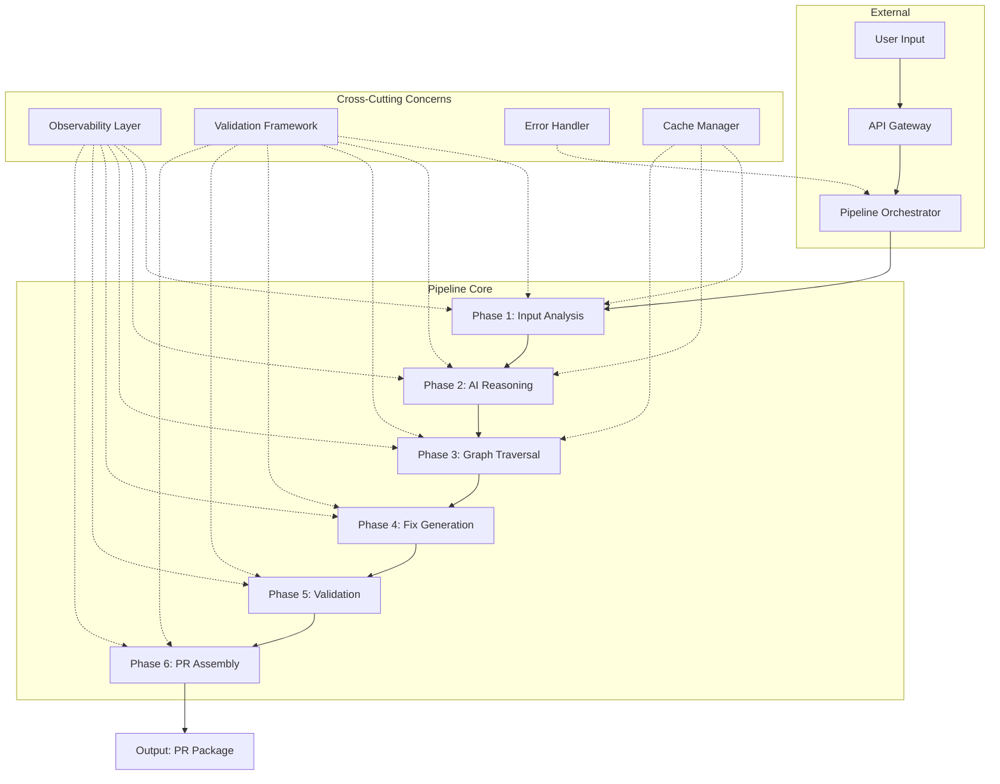
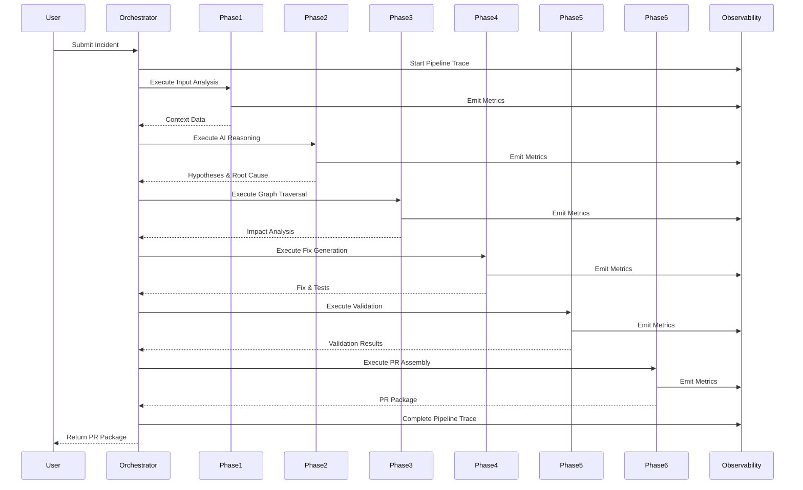

# 🏗️ PatchPilot Pipeline Architecture Design

**Version:** 3.0  
**Status:** Design Complete - Ready for Implementation  
**Last Updated:** 2026-05-01  
**Document Type:** Technical Design Specification

---

## 📋 Executive Summary

This document presents a comprehensive, modular end-to-end pipeline architecture for PatchPilot that transforms it from a functional prototype into an enterprise-grade incident-to-PR automation system. The design emphasizes **modularity**, **observability**, **resilience**, and **extensibility**.

### Key Design Principles

1. **Separation of Concerns**: Each phase is independent and testable
2. **Contract-Based Integration**: Clear input/output contracts between phases
3. **Fail-Safe Design**: Graceful degradation with comprehensive error handling
4. **Observable by Default**: Built-in metrics, logging, and tracing
5. **Configuration-Driven**: Flexible behavior through configuration
6. **Performance-Optimized**: Caching, parallel execution, and resource management

### Architecture Highlights

- **6 Core Pipeline Phases** with clear boundaries and validation gates
- **Centralized Orchestrator** managing phase lifecycle and error recovery
- **Comprehensive Observability** with metrics, structured logging, and distributed tracing
- **Enterprise-Ready Features** including multi-tenancy, rate limiting, and cost tracking
- **Modular Design** enabling easy testing, extension, and maintenance

---

## 🎯 Current State Analysis

### Existing Components Assessment

| Component | Completeness | Quality | Notes |
|-----------|--------------|---------|-------|
| AI Reasoning Engine | 85% | High | Well-structured, needs integration |
| Graph Traversal | 70% | Medium | Good foundation, needs optimization |
| Input Analysis | 75% | Medium | Solid parsing, needs validation layer |
| Fix Generation | 60% | Medium | Basic implementation, needs enhancement |
| PR Assembly | 65% | Medium | Good structure, needs metrics |
| Repository Manager | 80% | High | Robust GitHub integration |
| Graph Generator | 75% | High | Dynamic graph generation working |

### Critical Gaps Identified

1. **Pipeline Orchestrator** (0% complete) - **CRITICAL**
   - No centralized phase management
   - No error recovery or retry logic
   - No validation gates between phases

2. **Observability Layer** (10% complete) - **CRITICAL**
   - No structured metrics collection
   - No distributed tracing
   - Limited error tracking

3. **Error Handling & Resilience** (30% complete) - **CRITICAL**
   - No retry mechanisms
   - No circuit breakers for external services
   - Limited fallback strategies

4. **Validation Framework** (0% complete) - **CRITICAL**
   - No input/output validation
   - No quality gates
   - No schema enforcement

5. **Caching Layer** (0% complete) - **MEDIUM**
   - No repository caching
   - No graph caching
   - No AI response caching

---

## 🏛️ Pipeline Architecture Overview

### High-Level Architecture



### Pipeline Execution Flow



---

## 📦 Phase Definitions

### Phase 1: Input Analysis & Context Gathering

**Purpose**: Parse incident data, extract context, and prepare for investigation

**Responsibilities**:
- Parse stack traces and error messages
- Extract file paths and line numbers
- Classify error types
- Load repository context
- Generate or load dependency graph
- Enrich with code snippets

**Input Contract**:
```typescript
interface Phase1Input {
  incident: string;                    // Stack trace or error description
  repositoryUrl?: string;              // GitHub repository URL
  repositoryPath?: string;             // Local repository path
  config?: {
    maxFiles?: number;                 // Max files to analyze
    graphDepth?: number;               // Graph traversal depth
    cacheEnabled?: boolean;            // Enable caching
  };
}
```

**Output Contract**:
```typescript
interface Phase1Output {
  parsedError: {
    type: string;                      // Error type
    message: string;                   // Error message
    classification: ErrorClassification;
  };
  affectedFiles: Array<{
    path: string;
    lineNumber?: number;
    confidence: number;
  }>;
  repositoryContext: {
    framework: string;                 // Detected framework
    language: string;                  // Primary language
    architecture: string;              // Architecture pattern
    dependencies: string[];            // Key dependencies
  };
  dependencyGraph: {
    nodes: GraphNode[];
    edges: GraphEdge[];
    metrics: {
      totalNodes: number;
      totalEdges: number;
      communities: number;
    };
  };
  codeSnippets: Array<{
    file: string;
    content: string;
    relevance: number;
  }>;
  metadata: {
    duration: number;
    cacheHit: boolean;
  };
}
```

**Validation Rules**:
- At least one file must be extracted from incident
- Dependency graph must have at least 1 node
- Repository context must be populated
- All file paths must be valid

**Error Handling**:
- Retry repository cloning up to 3 times
- Fall back to provided code snippets if repo unavailable
- Use cached graph if generation fails
- Emit warning if no files extracted

---

### Phase 2: AI-Powered Reasoning

**Purpose**: Generate, evaluate, and confirm hypotheses using AI

**Responsibilities**:
- Generate 3-5 hypotheses using IBM watsonx
- Collect evidence for each hypothesis
- Systematically eliminate incorrect hypotheses
- Identify root cause with confidence score
- Generate reasoning chain for auditability

**Input Contract**:
```typescript
interface Phase2Input {
  context: Phase1Output;
  aiConfig: {
    model: string;                     // AI model to use
    temperature: number;               // Creativity level
    maxTokens: number;                 // Max response tokens
    timeout: number;                   // Request timeout
  };
}
```

**Output Contract**:
```typescript
interface Phase2Output {
  hypotheses: Array<{
    id: string;
    text: string;
    confidence: number;                // 0.0-1.0
    reasoning: string;
    evidence: string[];
  }>;
  eliminations: Array<{
    hypothesisId: string;
    reason: string;
    evidence: string;
    timestamp: number;
  }>;
  rootCause: {
    description: string;
    confidence: number;
    location: {
      file: string;
      line: number;
      function?: string;
    };
    evidence: string[];
    reasoning: string;
  };
  aiMetrics: {
    tokensUsed: number;
    cost: number;                      // USD
    latency: number;                   // ms
    modelVersion: string;
    retries: number;
  };
  metadata: {
    duration: number;
    fallbackUsed: boolean;
  };
}
```

**Validation Rules**:
- Must generate at least 2 hypotheses
- Final hypothesis confidence must be > 0.7
- Root cause must include file location
- At least 2 pieces of evidence required

**Error Handling**:
- Retry AI calls with exponential backoff (3 attempts)
- Circuit breaker after 5 consecutive failures
- Fall back to rule-based analysis if AI unavailable
- Cache successful responses for similar incidents

---

### Phase 3: Graph Traversal & Impact Analysis

**Purpose**: Calculate blast radius and assess change impact

**Responsibilities**:
- Traverse dependency graph from affected nodes
- Calculate impact scores with decay
- Identify critical paths
- Assess risk level
- Generate traversal path

**Input Contract**:
```typescript
interface Phase3Input {
  rootCause: Phase2Output['rootCause'];
  graph: Phase1Output['dependencyGraph'];
  config: {
    maxDepth: number;                  // Max traversal depth
    decayFactor: number;               // Score decay per hop
    minScore: number;                  // Min score threshold
    includeTests: boolean;             // Include test files
  };
}
```

**Output Contract**:
```typescript
interface Phase3Output {
  affectedFiles: Array<{
    file: string;
    score: number;                     // 0.0-1.0
    reason: string;
    distance: number;                  // Hops from root
    criticalPath: boolean;
  }>;
  blastRadius: {
    totalFiles: number;
    criticalFiles: number;
    communities: number;
    maxDepth: number;
  };
  traversalPath: string[];             // Ordered path
  riskAssessment: {
    level: 'low' | 'medium' | 'high' | 'critical';
    score: number;                     // 0-100
    factors: string[];
    mitigations: string[];
  };
  graphMetrics: {
    nodesTraversed: number;
    edgesTraversed: number;
    communitiesAnalyzed: number;
    centralityScore: number;
  };
  metadata: {
    duration: number;
    algorithm: string;
  };
}
```

---

### Phase 4: Fix Generation & Test Creation

**Purpose**: Generate surgical fixes with comprehensive tests

**Input Contract**:
```typescript
interface Phase4Input {
  rootCause: Phase2Output['rootCause'];
  affectedFiles: Phase3Output['affectedFiles'];
  codeSnippets: Phase1Output['codeSnippets'];
  config: {
    fixStrategy: 'minimal' | 'defensive' | 'comprehensive';
    testFramework: string;
    requireTests: boolean;
    minCoverage: number;
  };
}
```

**Output Contract**:
```typescript
interface Phase4Output {
  fix: {
    description: string;
    diff: string;                      // Unified diff format
    files: Array<{
      path: string;
      changes: string;
      linesAdded: number;
      linesRemoved: number;
    }>;
    riskLevel: 'low' | 'medium' | 'high';
  };
  tests: {
    content: string;
    framework: string;
    coverage: number;
    testCases: Array<{
      name: string;
      type: 'unit' | 'integration' | 'edge-case';
      description: string;
    }>;
  };
  defensiveImprovements: Array<{
    description: string;
    priority: 'high' | 'medium' | 'low';
    effort: 'small' | 'medium' | 'large';
  }>;
  metadata: {
    duration: number;
    aiGenerated: boolean;
  };
}
```

---

### Phase 5: Validation & Quality Gates

**Purpose**: Validate fixes and enforce quality standards

**Input Contract**:
```typescript
interface Phase5Input {
  fix: Phase4Output['fix'];
  tests: Phase4Output['tests'];
  config: {
    strictMode: boolean;
    lintRules: string[];
    minCoverage: number;
    securityScan: boolean;
  };
}
```

**Output Contract**:
```typescript
interface Phase5Output {
  validation: {
    syntaxValid: boolean;
    typesValid: boolean;
    lintPassed: boolean;
    coverageAdequate: boolean;
    securityPassed: boolean;
    errors: Array<{
      type: string;
      message: string;
      severity: 'error' | 'warning';
    }>;
  };
  qualityScore: {
    overall: number;                   // 0-100
    breakdown: {
      syntax: number;
      types: number;
      lint: number;
      coverage: number;
      security: number;
    };
  };
  recommendations: string[];
  metadata: {
    duration: number;
    toolsUsed: string[];
  };
}
```

---

### Phase 6: PR Assembly & Metrics

**Purpose**: Assemble complete PR package with documentation and metrics

**Input Contract**:
```typescript
interface Phase6Input {
  allPhaseOutputs: {
    phase1: Phase1Output;
    phase2: Phase2Output;
    phase3: Phase3Output;
    phase4: Phase4Output;
    phase5: Phase5Output;
  };
  config: {
    prTitle: string;
    branchName: string;
    labels: string[];
    includeMetrics: boolean;
  };
}
```

**Output Contract**:
```typescript
interface Phase6Output {
  prPackage: {
    title: string;
    description: string;
    branch: string;
    diff: string;
    tests: string;
    documentation: string;
    rollbackPlan: string;
  };
  metrics: {
    totalTime: number;
    phaseBreakdown: Record<string, number>;
    aiCost: number;
    confidenceScore: number;
    filesAffected: number;
    linesChanged: number;
  };
  estimatedSavings: {
    timeHours: number;
    costDollars: number;
    comparisonToManual: string;
  };
  qualityScore: {
    overall: number;
    testCoverage: number;
    documentationQuality: number;
    riskLevel: string;
  };
  metadata: {
    duration: number;
    timestamp: string;
  };
}
```

---

## 🎛️ Pipeline Orchestrator Design

### Core Interface

```typescript
interface PipelineOrchestrator {
  execute(input: PipelineInput): Promise<PipelineResult>;
  executePhase<T, R>(phase: PipelinePhase<T, R>, input: T): Promise<PhaseResult<R>>;
  getStatus(): PipelineStatus;
  getMetrics(): PipelineMetrics;
  cancel(): Promise<void>;
  resume(checkpointId: string): Promise<PipelineResult>;
}
```

### Pipeline Context

```typescript
interface PipelineContext {
  executionId: string;
  input: PipelineInput;
  config: PipelineConfig;
  phaseOutputs: {
    phase1?: Phase1Output;
    phase2?: Phase2Output;
    phase3?: Phase3Output;
    phase4?: Phase4Output;
    phase5?: Phase5Output;
    phase6?: Phase6Output;
  };
  metadata: {
    startTime: number;
    currentPhase: number;
    checkpoints: Checkpoint[];
    errors: PipelineError[];
    warnings: string[];
  };
  trace: {
    traceId: string;
    spanId: string;
    parentSpanId?: string;
  };
}
```

### Phase Interface

```typescript
interface PipelinePhase<TInput, TOutput> {
  readonly name: string;
  readonly version: string;
  readonly timeout: number;
  
  execute(input: TInput, context: PipelineContext): Promise<PhaseResult<TOutput>>;
  validateInput(input: TInput): ValidationResult;
  validateOutput(output: TOutput): ValidationResult;
  handleError(error: Error, context: PipelineContext): ErrorHandlingStrategy;
  getMetrics(): PhaseMetrics;
}
```

---

## 🔧 Module Structure

```
lib/
├── pipeline/
│   ├── core/
│   │   ├── orchestrator.ts           # Main orchestrator
│   │   ├── phase-interface.ts        # Base phase interface
│   │   ├── context.ts                # Pipeline context
│   │   ├── config.ts                 # Configuration
│   │   └── checkpoint.ts             # Checkpoint management
│   │
│   ├── phases/
│   │   ├── phase1-input-analysis.ts
│   │   ├── phase2-ai-reasoning.ts
│   │   ├── phase3-graph-traversal.ts
│   │   ├── phase4-fix-generation.ts
│   │   ├── phase5-validation.ts
│   │   └── phase6-pr-assembly.ts
│   │
│   ├── validation/
│   │   ├── validator.ts              # Base validator
│   │   ├── schema-validator.ts       # JSON schema validation
│   │   ├── quality-gates.ts          # Quality gates
│   │   └── rules/
│   │       ├── input-rules.ts
│   │       ├── output-rules.ts
│   │       └── quality-rules.ts
│   │
│   ├── observability/
│   │   ├── logger.ts                 # Structured logging
│   │   ├── metrics.ts                # Metrics collection
│   │   ├── tracer.ts                 # Distributed tracing
│   │   └── dashboard.ts              # Metrics dashboard
│   │
│   ├── resilience/
│   │   ├── retry-manager.ts          # Retry logic
│   │   ├── circuit-breaker.ts        # Circuit breaker
│   │   ├── timeout-manager.ts        # Timeout handling
│   │   └── fallback-handler.ts       # Fallback strategies
│   │
│   ├── cache/
│   │   ├── cache-manager.ts          # Cache interface
│   │   ├── repository-cache.ts       # Repo caching
│   │   ├── graph-cache.ts            # Graph caching
│   │   └── ai-cache.ts               # AI response caching
│   │
│   └── types/
│       ├── pipeline.types.ts         # Core types
│       ├── phase.types.ts            # Phase types
│       ├── error.types.ts            # Error types
│       └── config.types.ts           # Config types
```

---

## 🔄 Data Flow & State Management

### Context Flow


### Checkpoint Strategy

```typescript
interface Checkpoint {
  id: string;
  executionId: string;
  phaseNumber: number;
  phaseName: string;
  timestamp: number;
  context: PipelineContext;
  hash: string;
}
```

---

## 📊 Observability Layer

### Metrics Collection

```typescript
interface PhaseMetrics {
  phaseName: string;
  duration: number;
  status: 'success' | 'failure' | 'skipped';
  retries: number;
  cacheHit: boolean;
  inputSize: number;
  outputSize: number;
  customMetrics: Record<string, number>;
}
```

### Structured Logging

```typescript
interface LogEntry {
  timestamp: string;
  level: 'debug' | 'info' | 'warn' | 'error';
  message: string;
  context: {
    executionId: string;
    phase: string;
    traceId: string;
  };
  metadata?: Record<string, any>;
}
```

### Distributed Tracing

```typescript
interface Trace {
  traceId: string;
  spans: Span[];
  duration: number;
  status: 'success' | 'error';
}

interface Span {
  spanId: string;
  parentSpanId?: string;
  name: string;
  startTime: number;
  endTime: number;
  tags: Record<string, string>;
  logs: LogEntry[];
}
```

---

## 🛡️ Resilience & Error Handling

### Retry Strategy

```typescript
interface RetryConfig {
  maxAttempts: number;
  backoffMs: number;
  backoffMultiplier: number;
  retryableErrors: string[];
}

// Example: AI calls
const aiRetryConfig: RetryConfig = {
  maxAttempts: 3,
  backoffMs: 1000,
  backoffMultiplier: 2,
  retryableErrors: ['RATE_LIMIT', 'TIMEOUT', 'SERVICE_UNAVAILABLE']
};
```

### Circuit Breaker

```typescript
interface CircuitBreakerConfig {
  failureThreshold: number;
  resetTimeoutMs: number;
  monitoringPeriodMs: number;
}

// Example: AI service
const aiCircuitBreaker: CircuitBreakerConfig = {
  failureThreshold: 5,
  resetTimeoutMs: 60000,
  monitoringPeriodMs: 60000
};
```

### Graceful Degradation

1. **AI Failure**: Fall back to rule-based analysis
2. **Graph Failure**: Use file-based analysis
3. **Repository Failure**: Use provided code snippets
4. **Test Generation Failure**: Provide test templates

---

## 💾 Caching Strategy

### Cache Layers

```typescript
interface CacheManager {
  // Repository cache
  cacheRepository(url: string, data: any, ttl: number): Promise<void>;
  getRepository(url: string): Promise<any | null>;
  
  // Graph cache
  cacheGraph(repoId: string, graph: any, ttl: number): Promise<void>;
  getGraph(repoId: string): Promise<any | null>;
  
  // AI response cache
  cacheAIResponse(prompt: string, response: any, ttl: number): Promise<void>;
  getAIResponse(prompt: string): Promise<any | null>;
  
  // Clear cache
  clearCache(pattern?: string): Promise<void>;
}
```

### Cache Configuration

```typescript
interface CacheConfig {
  enabled: boolean;
  ttl: {
    repository: number;      // 1 hour
    graph: number;           // 30 minutes
    aiResponse: number;      // 24 hours
  };
  maxSize: {
    repository: number;      // 100 MB
    graph: number;           // 50 MB
    aiResponse: number;      // 200 MB
  };
  evictionPolicy: 'LRU' | 'LFU' | 'FIFO';
}
```

---

## 🔌 Integration Points

### Existing Components Integration

**Keep & Enhance**:
- [`lib/ai/reasoning-engine.ts`](lib/ai/reasoning-engine.ts) → Integrate into Phase 2
- [`lib/graph.ts`](lib/graph.ts) → Integrate into Phase 3
- [`lib/github/repo-manager.ts`](lib/github/repo-manager.ts) → Integrate into Phase 1
- [`lib/analyzer.ts`](lib/analyzer.ts) → Refactor into pipeline phases

**New Components**:
- `lib/pipeline/orchestrator.ts`
- `lib/pipeline/phases/` (6 phase implementations)
- `lib/observability/` (logging, metrics, tracing)
- `lib/resilience/` (retry, circuit breaker)
- `lib/validators/` (input/output validation)

### API Endpoints

```typescript
// Trigger pipeline execution
POST /api/pipeline/execute
{
  "incident": "string",
  "repositoryUrl": "string",
  "config": { ... }
}

// Get pipeline status
GET /api/pipeline/status/:executionId

// Get pipeline metrics
GET /api/pipeline/metrics/:executionId

// Cancel pipeline
POST /api/pipeline/cancel/:executionId

// Resume from checkpoint
POST /api/pipeline/resume/:checkpointId
```

### Streaming Updates

```typescript
// SSE endpoint for real-time updates
GET /api/pipeline/stream/:executionId

// Event types
type PipelineEvent =
  | { type: 'phase_start'; phase: string }
  | { type: 'phase_complete'; phase: string; output: any }
  | { type: 'phase_error'; phase: string; error: string }
  | { type: 'metric'; metric: PhaseMetrics }
  | { type: 'log'; log: LogEntry }
  | { type: 'complete'; result: PipelineResult };
```

---

## 🏢 Enterprise Features

### Multi-Tenancy Support

```typescript
interface TenantConfig {
  tenantId: string;
  quotas: {
    maxExecutionsPerHour: number;
    maxConcurrentExecutions: number;
    maxAICost: number;
  };
  features: {
    aiEnabled: boolean;
    cachingEnabled: boolean;
    advancedMetrics: boolean;
  };
}
```

### Rate Limiting

```typescript
interface RateLimitConfig {
  windowMs: number;
  maxRequests: number;
  strategy: 'fixed' | 'sliding' | 'token-bucket';
  keyGenerator: (req: Request) => string;
}
```

### Audit Logging

```typescript
interface AuditLog {
  timestamp: string;
  tenantId: string;
  userId: string;
  action: string;
  resource: string;
  result: 'success' | 'failure';
  metadata: Record<string, any>;
}
```

### Cost Tracking

```typescript
interface CostMetrics {
  executionId: string;
  breakdown: {
    aiCost: number;
    computeCost: number;
    storageCost: number;
    totalCost: number;
  };
  resourceUsage: {
    cpuSeconds: number;
    memoryMbSeconds: number;
    networkGb: number;
  };
}
```

---

## ⚡ Performance Optimization

### Parallel Execution

```typescript
// Execute independent operations in parallel
async function executePhase1(input: Phase1Input): Promise<Phase1Output> {
  const [parsedError, graph, codeSnippets] = await Promise.all([
    parseStackTrace(input.incident),
    loadOrGenerateGraph(input.repositoryUrl),
    extractCodeSnippets(input.incident)
  ]);
  
  return { parsedError, graph, codeSnippets, ... };
}
```

### Resource Limits

```typescript
interface ResourceLimits {
  maxMemoryMb: number;
  maxCpuPercent: number;
  maxExecutionTimeMs: number;
  maxConcurrentPhases: number;
}
```

### Optimization for Large Repositories

- **Shallow cloning**: `git clone --depth 1`
- **Selective file analysis**: Analyze only relevant files
- **Graph sampling**: Sample large graphs for performance
- **Incremental processing**: Process in chunks

---

## 📈 Success Metrics

### Performance Targets

- **Total Pipeline Time**: < 30 seconds (p95)
- **AI Latency**: < 10 seconds per call
- **Graph Traversal**: < 5 seconds for 10K nodes
- **Success Rate**: > 95%

### Quality Targets

- **Confidence Score**: > 0.85 average
- **Test Coverage**: > 80%
- **Fix Validation**: > 90% pass rate
- **PR Acceptance**: > 70%

### Cost Targets

- **AI Cost**: < $0.01 per investigation
- **Infrastructure**: < $0.001 per investigation
- **Total Cost**: < $0.02 per investigation

---

## 🚀 Implementation Roadmap

### Phase 1: Foundation (Week 1-2)

**Deliverables**:
- Pipeline orchestrator skeleton
- Phase interface definitions
- Base validation framework
- Basic observability (logging)

**Files to Create**:
- `lib/pipeline/core/orchestrator.ts`
- `lib/pipeline/core/phase-interface.ts`
- `lib/pipeline/core/context.ts`
- `lib/pipeline/validation/validator.ts`
- `lib/pipeline/observability/logger.ts`

### Phase 2: Core Phases (Week 3-5)

**Deliverables**:
- Implement all 6 pipeline phases
- Integrate existing components
- Add phase-level validation
- Implement checkpointing

**Files to Create**:
- `lib/pipeline/phases/phase1-input-analysis.ts`
- `lib/pipeline/phases/phase2-ai-reasoning.ts`
- `lib/pipeline/phases/phase3-graph-traversal.ts`
- `lib/pipeline/phases/phase4-fix-generation.ts`
- `lib/pipeline/phases/phase5-validation.ts`
- `lib/pipeline/phases/phase6-pr-assembly.ts`

### Phase 3: Resilience (Week 6)

**Deliverables**:
- Retry manager
- Circuit breaker
- Timeout handling
- Fallback strategies

**Files to Create**:
- `lib/pipeline/resilience/retry-manager.ts`
- `lib/pipeline/resilience/circuit-breaker.ts`
- `lib/pipeline/resilience/timeout-manager.ts`
- `lib/pipeline/resilience/fallback-handler.ts`

### Phase 4: Observability (Week 7)

**Deliverables**:
- Metrics collection
- Distributed tracing
- Dashboard integration
- Alert configuration

**Files to Create**:
- `lib/pipeline/observability/metrics.ts`
- `lib/pipeline/observability/tracer.ts`
- `lib/pipeline/observability/dashboard.ts`

### Phase 5: Caching & Optimization (Week 8)

**Deliverables**:
- Cache manager
- Repository caching
- Graph caching
- AI response caching

**Files to Create**:
- `lib/pipeline/cache/cache-manager.ts`
- `lib/pipeline/cache/repository-cache.ts`
- `lib/pipeline/cache/graph-cache.ts`
- `lib/pipeline/cache/ai-cache.ts`

### Phase 6: Testing & Documentation (Week 9)

**Deliverables**:
- Unit tests for all phases
- Integration tests
- End-to-end tests
- API documentation

**Files to Create**:
- `tests/unit/pipeline/*.test.ts`
- `tests/integration/pipeline.test.ts`
- `tests/e2e/full-pipeline.test.ts`
- `docs/API_REFERENCE.md`

---

## 🔍 Testing Strategy

### Unit Tests

```typescript
describe('Phase1InputAnalysis', () => {
  it('should parse stack trace correctly', async () => {
    const phase = new Phase1InputAnalysis();
    const input = { incident: 'TypeError: ...' };
    const result = await phase.execute(input, mockContext);
    expect(result.parsedError.type).toBe('TypeError');
  });
  
  it('should handle invalid input gracefully', async () => {
    const phase = new Phase1InputAnalysis();
    const input = { incident: '' };
    await expect(phase.execute(input, mockContext)).rejects.toThrow();
  });
});
```

### Integration Tests

```typescript
describe('Pipeline Integration', () => {
  it('should execute full pipeline successfully', async () => {
    const orchestrator = new PipelineOrchestrator();
    const result = await orchestrator.execute({
      incident: mockStackTrace,
      repositoryUrl: mockRepoUrl
    });
    expect(result.success).toBe(true);
    expect(result.prPackage).toBeDefined();
  });
});
```

### Performance Tests

```typescript
describe('Pipeline Performance', () => {
  it('should complete within 30 seconds', async () => {
    const start = Date.now();
    await orchestrator.execute(mockInput);
    const duration = Date.now() - start;
    expect(duration).toBeLessThan(30000);
  });
});
```

---

## 📚 References

- [IBM watsonx Documentation](https://www.ibm.com/docs/en/watsonx)
- [Circuit Breaker Pattern](https://martinfowler.com/bliki/CircuitBreaker.html)
- [Distributed Tracing](https://opentelemetry.io/)
- [Pipeline Pattern](https://martinfowler.com/articles/patterns-of-distributed-systems/pipeline.html)

---

## ✅ Design Review Checklist

- [x] All 6 phases clearly defined with contracts
- [x] Orchestrator design complete
- [x] Validation framework specified
- [x] Observability layer designed
- [x] Resilience patterns defined
- [x] Caching strategy outlined
- [x] Module structure specified
- [x] Integration points documented
- [x] Enterprise features included
- [x] Implementation roadmap created
- [x] Testing strategy defined
- [x] Performance targets set

---

**Document Status**: ✅ Complete - Ready for Implementation  
**Next Steps**: Review with stakeholders → Begin Phase 1 implementation  
**Owner**: Engineering Team  
**Reviewers**: Architecture Team, Product Team

---

*This design document serves as the blueprint for transforming PatchPilot into an enterprise-grade pipeline system. All implementation should follow this specification to ensure consistency, quality, and maintainability.*